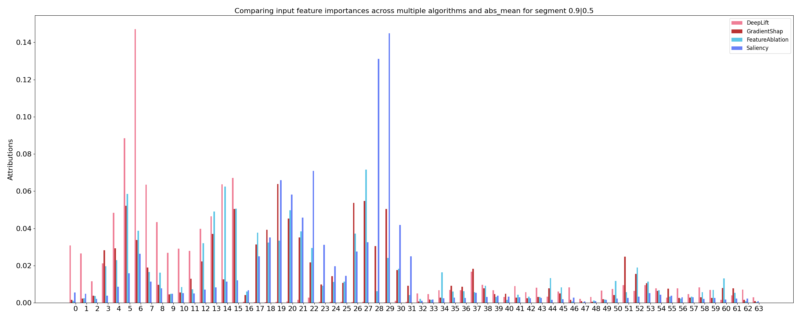

# A-Deeper-Look-at-Machine-Learning-Based-Cryptanalysis

This is the official repository for the paper [A Deeper Look at Machine Learning-Based Cryptanalysis](https://eprint.iacr.org/2021/287)


## Requirements

This project was coded in python3.6
Requires libraries can be found in requirements.txt.

## Reproductibility

To reproduce the results, you can directly run ```python3 run_reproduction_all.py```

### Section 5

To reproduce the results Table 10 and 11 of the paper, you need to run the following commands

```
python3 main_reproduction_speck_5round.py
python3 main_reproduction_speck_6round.py
``` 

To reproduce the results of Section 5.5, you need to run the following command

```
python3 main_reproduction_simon_8round.py
``` 

### Section 6

To reproduce the results of Section 6, you need to run the following command

```
python3 main_reproduction_speck_averaging_batches.py
``` 

## Demo

Colab demo:


[](https://colab.research.google.com/github/AnonymousSubmissionEuroCrypt2021/A-Deeper-Look-at-Machine-Learning-Based-Cryptanalysis/blob/master/demo.ipynb)


## Summary of the analysis of the pipeline

Bt running the ```main.py``` program, you can find results in the result folder that summary the run.

Files `logs_lgbm.txt` and `res_0.npy` give the results of the run.


### Importance of the Masks / Features

You will find a file `quality_masks.csv` which compare the quality of the masks found according different criterions.
There is also a study on the independance of the masks between one another in `COMPARASION INTRA FEATURES XI 2.csv` and with the label in`INDEPENACE FEATURES LABELS.csv`.

#### Example of feature importance for 5 round speck

This figure orders the features according their importance for the classification.


#### Example of decision tree for LGBM for 5 round speck

This figure shows the decision tree for the classification.


#### Example of how important is each bit for the decision of the neural distinguisher for 5 round speck

These figures show how important is each bit for the decision of the neural distinguisher for different methods.



#### Other 

We also provides the possibility to change the final classifier and the inputs.


Please use this bibtex if you want to cite this repo

```
@misc{cryptoeprint:2021:287,
    author = {Adrien Benamira and David Gerault and Thomas Peyrin and Quan Quan Tan},
    title = {A Deeper Look at Machine Learning-Based Cryptanalysis},
    howpublished = {Cryptology ePrint Archive, Report 2021/287},
    year = {2021},
    note = {\url{https://eprint.iacr.org/2021/287}},
}
```
